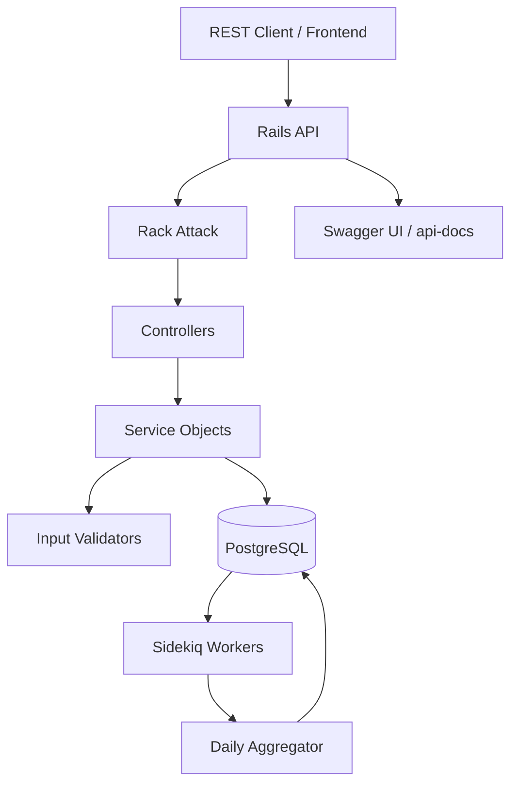

# Restaurant Order Management API

[](https://www.ruby-lang.org/)
[](https://rubyonrails.org/)
[](https://www.postgresql.org/)
[](https://rspec.info/)
[](swagger/v1/swagger.yaml)
[](LICENSE)

A production-ready REST API for managing restaurant orders with robust transaction integrity. This system focuses on order lifecycle management and accurate financial tracking, designed for easy integration with external payment systems and POS terminals.

## 🌟 Key Features

### 🛡️ Production-Ready Reliability
- **Idempotent Operations**: Support for `X-Idempotency-Key` to prevent duplicate orders.
- **Concurrency Control**: Optimistic/Pessimistic locking to handle simultaneous updates.
- **Rate Limiting**: Integrated `rack-attack` to prevent DDoS and brute-force attacks.
- **Standardized Error Handling**: Uniform JSON error responses for better API integration.

### 💰 Financial Integrity
- **Price Snapshots**: Captures menu prices at order time for accurate historical tracking.
- **Japanese Tax Compliance**: Automatic 10% consumption tax calculation with proper rounding.
- **Integer-based Arithmetic**: Prevents floating-point errors in financial calculations.

### 📊 Performance & Analytics
- **Daily Aggregation**: Automated sales statistics per menu item using Sidekiq.
- **SQL-Optimized**: High-performance aggregation using PostgreSQL's bulk upsert.
- **Analytics API**: Flexible metrics and summaries with date range support.

## 🏗️ Technical Architecture

### Design Patterns
- **Service Object Pattern**: Lean controllers with business logic encapsulated in services.
- **Validator Pattern**: Decoupled input validation for maintainability.
- **Price Integrity**: Historical price consistency via JSONB snapshots.

### System Components


## 📋 Prerequisites

- Docker & Docker Compose
- Git
- Postman / curl (for testing)

## 🚀 Quick Start

### 1. Setup
```bash
git clone https://github.com/0gawa/reliable-chumon-api.git
cd reliable-chumon-api

# Build and migrate
docker-compose build
docker-compose run --rm web rails db:setup
```

### 2. Run
```bash
docker-compose up
```
- **API**: `http://localhost:3000`
- **Sidekiq Dashboard**: `http://localhost:3000/sidekiq` (Development only)

## 📚 API Documentation

### Interactive Documentation (Swagger UI)
This project features built-in OpenAPI 3.0 documentation.
- **Swagger UI**: `http://localhost:3000/api-docs`
- **OpenAPI Spec**: `swagger/v1/swagger.yaml`

### Standardized Error Format
All errors follow a consistent structure:
```json
{
  "error": {
    "status": 422,
    "code": "VALIDATION_ERROR",
    "message": "Validation failed",
    "details": {
      "errors": ["OrderItem items must be present"]
    },
    "timestamp": "2026-02-04T00:00:00+09:00"
  }
}
```

#### Common Error Codes
| Code | HTTP | Description |
|------|------|-------------|
| `VALIDATION_ERROR` | 422 | Invalid input data |
| `MISSING_PARAMETER` | 400 | Required parameters missing |
| `NOT_FOUND` | 404 | Resource not found |
| `STALE_OBJECT` | 409 | Conflict (Optimistic locking fail) |
| `DUPLICATE_REQUEST` | 200/409 | Idempotency key conflict |
| `INTERNAL_ERROR` | 500 | Unexpected server error |

### Advanced Patterns

#### Idempotency Support
Included in `POST /api/v1/customer/orders`.
- Header: `X-Idempotency-Key` (UUID v4)
- Result: If the key is reused, the API returns the original response without creating a new order.

#### Rate Limiting
Configured via `rack-attack`:
- **Requests**: 100 requests per minute per IP.
- **Exceeding**: Returns `429 Too Many Requests`.

## 🧪 Testing

We value quality. The project maintains **144 examples with 0 failures**.

```bash
# Run all tests
docker-compose exec web rspec

# Run specific integration tests
docker-compose exec web rspec spec/integration
```

## 📈 Benchmarks


| Operation | Scale | Performance | Note |
|-----------|-------|-------------|------|
| Order Creation | Complex | ~45ms | Including tax calculation & snapshots |
| Daily Aggregation | 1,000 orders | < 15ms | SQL-based bulk upsert |
| Bulk Import | 100 items | < 20ms | PostgreSQL optimized |


## ❓ FAQ

**Q: Does this API include user authentication?**
A: No. It is designed to be seated behind an API Gateway or Reverse Proxy (like Kong or AWS API Gateway) which handles authentication and authorization.

**Q: Does it handle actual payment processing (Stripe, etc.)?**
A: No. This API focuses on order lifecycle management and financial accuracy. It provides the reliable data needed by payment providers but doesn't interact with them directly.

**Q: Is it suitable for high-traffic environments?**
A: Yes. It includes rate limiting, database optimizations (bulk upserts, indexing), and concurrency control (locking) to handle production loads.

**Q: Why use integer-based arithmetic for prices?**
A: Floating-point arithmetic can lead to rounding errors in financial calculations (e.g., 0.1 + 0.2 != 0.3). Using integers (representing the smallest currency unit) ensures 100% precision.

## 🤝 Contributing

We welcome contributions! Please see [CONTRIBUTING.md](CONTRIBUTING.md) for guidelines.

## 📝 License

Distributed under the MIT License. See [LICENSE](LICENSE) for more information.

---

**Made with ❤️ for the restaurant industry**
